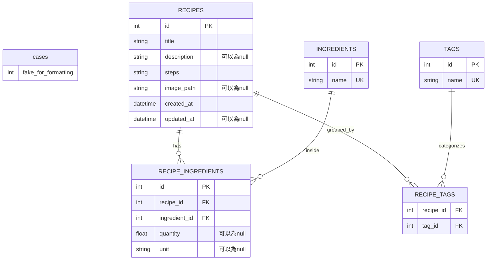

# 資料庫設計文件 (Database Design)

本文件詳細說明了「食譜收藏系統」的 SQLite 資料庫結構設計，包含 ER 圖、資料表詳細屬性與關聯。

## 1. ER 圖 (實體關係圖)

## 2. 資料表詳細說明

### 2.1 RECIPES (食譜表)
負責儲存食譜本身的主要資訊。
| 欄位名稱 | 型別 | 屬性 | 說明 |
| --- | --- | --- | --- |
| `id` | INTEGER | PK, AutoIncrement | 唯一識別碼 |
| `title` | TEXT | Not Null | 食譜名稱 |
| `description` | TEXT | | 簡短描述或來源筆記 |
| `steps` | TEXT | Not Null | 烹調步驟 (為了簡化，採直接存為多行純文字) |
| `image_path` | TEXT | | 食譜照片的本地端靜態檔案路徑 |
| `created_at` | DATETIME | Default: CURRENT_TIMESTAMP | 建立時間 |
| `updated_at` | DATETIME | | 最後修改時間 |

### 2.2 INGREDIENTS (食材庫)
系統內獨立管理的所有食材字彙，可用於反向搜尋。
| 欄位名稱 | 型別 | 屬性 | 說明 |
| --- | --- | --- | --- |
| `id` | INTEGER | PK, AutoIncrement | 唯一識別碼 |
| `name` | TEXT | Not Null, Unique | 食材名稱 (如：雞腿肉、青蔥) |

### 2.3 RECIPE_INGREDIENTS (食譜食材關聯表)
紀錄某個食譜中使用了哪些食材，以及「用量與單位」，以支援自動生成採購清單。
| 欄位名稱 | 型別 | 屬性 | 說明 |
| --- | --- | --- | --- |
| `id` | INTEGER | PK, AutoIncrement | 關聯獨立 ID |
| `recipe_id` | INTEGER | FK (ref recipes.id), Not Null | 對應食譜的 ID |
| `ingredient_id` | INTEGER | FK (ref ingredients.id), Not Null| 對應食材的 ID |
| `quantity` | REAL(Float) | | 用量 (如：300) |
| `unit` | TEXT | | 單位 (如：克、匙) |

### 2.4 TAGS (標籤庫)
為了分類食譜而建立的標籤集合。
| 欄位名稱 | 型別 | 屬性 | 說明 |
| --- | --- | --- | --- |
| `id` | INTEGER | PK, AutoIncrement | 唯一識別碼 |
| `name` | TEXT | Not Null, Unique | 標籤名稱 (如：台式料理、快速上菜) |

### 2.5 RECIPE_TAGS (食譜標籤關聯表)
一個食譜可擁有多個標籤，一個標籤可包含多個食譜（多對多關係）。
| 欄位名稱 | 型別 | 屬性 | 說明 |
| --- | --- | --- | --- |
| `recipe_id` | INTEGER | FK (ref recipes.id), PK | 對應食譜的 ID |
| `tag_id` | INTEGER | FK (ref tags.id), PK | 對應標籤的 ID |
*(此表以這兩個欄位組成複合 Primary Key)*

---
