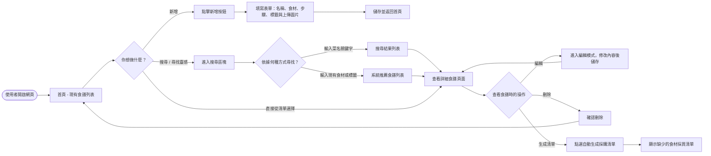
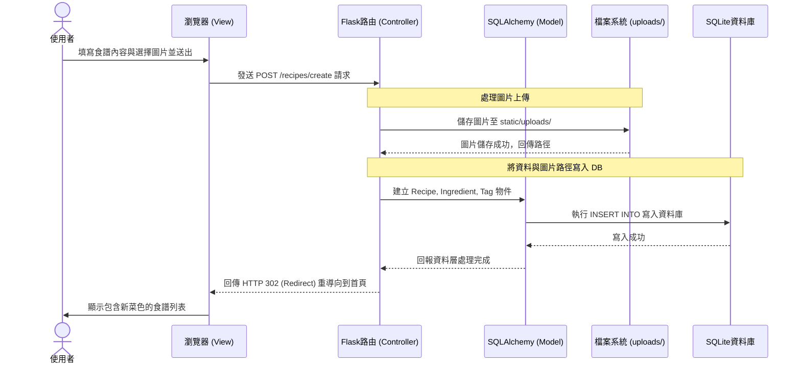

# 食譜收藏系統 - 流程圖與路由設計

這份文件介紹了使用者在「食譜收藏系統」裡的操作路徑，系統的內部資料流，以及基礎的路由設計規劃。

## 1. 使用者流程圖 (User Flow)

這張圖描述了使用者進入網站後，如何尋找、新增以及管理自己的食譜庫：

---

## 2. 系統序列圖 (Sequence Diagram)

這張序列圖描述了「使用者新增一個新食譜並上傳圖片」時，各個系統元件之間完整的資料流動過程：

---

## 3. 功能清單與路由對照表

根據架構與 MVP 需求，初步規劃出前端需要對接的 Flask 路由，涵蓋 GET 與 POST 等基礎操作：

| 系統功能 | URL 路徑 (路由) | HTTP 方法 | 描述與動作 |
| --- | --- | --- | --- |
| **首頁與列表** | `/` | `GET` | 首頁，顯示所有食譜列表（預設以最新建立排序） |
| **新增食譜頁面** | `/recipes/create` | `GET` | 顯示提供使用者填寫食譜資料的表單介面 |
| **處理新增食譜** | `/recipes/create` | `POST` | 處理表單送出事件，儲存圖片與寫入資料庫 |
| **單一食譜細節** | `/recipes/<id>` | `GET` | 顯示該食譜的詳細步驟、圖文說明與現有食材 |
| **編輯食譜頁面** | `/recipes/<id>/edit` | `GET` | 顯示編輯介面，並代入該食譜既有的資料 |
| **處理編輯食譜** | `/recipes/<id>/edit` | `POST` | 處理覆蓋或更新資料庫中的食譜資料 |
| **刪除食譜** | `/recipes/<id>/delete` | `POST` | 要求從資料庫中將指定的食譜徹底刪除 |
| **搜尋/推薦 API** | `/search` | `GET` | 使用者透過查詢字串 (`?q=...` 或 `?ingredients=...`) 進行菜色與食材的關鍵字反查 |
| **產生採購清單** | `/recipes/<id>/shopping-list` | `GET` | 系統計算並回傳該食譜推薦的採購清單細節頁面 |
